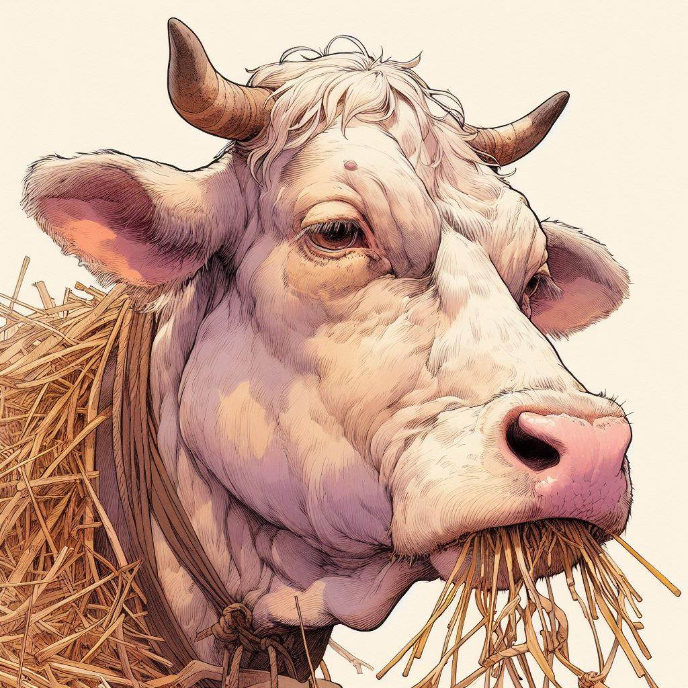

# Windows File Mover

這是我負責養的牛，它只有傍晚才會開始耕田，平常沒事就睡覺跟吃草。但是只要我老闆出來打牠，牠就會爆衝，為了紀念牠的特色我決定拿牠的圖片當我的工具的 icon，牠讓我更加理解什麼是"對牛彈琴"。

### Update Version
- 20240227 v.0.0.1.0 該工具能讓使用者指定想要分類的資料夾名稱，並將圖片用點擊按鈕的方式將圖片分類至指定資料夾中。
- 20240229 v.0.0.1.1 修復的無法放大圖片的錯誤，並新增了禿頭老牛的icon。
